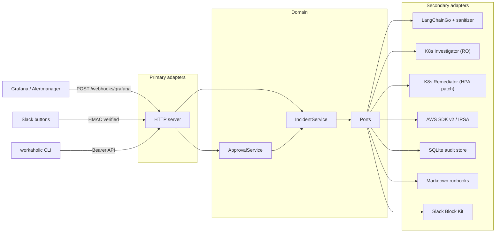

# Workaholic

Autonomous **1st-level incident response** for Kubernetes and AWS.

Workaholic receives monitoring alerts (Grafana / Alertmanager), inspects cluster and cloud context with an LLM, consults local Markdown runbooks, and either **auto-remediates low-risk changes** (for example raising an HPA `maxReplicas` cap) or **asks a human on Slack** before applying anything else.

It is a production-oriented Go service built as **Hexagonal Architecture** (ports and adapters). The domain layer has zero dependencies on cloud SDKs, SQLite, Slack, or HTTP.

---

## Architecture



```
                 ┌─────────────────────────────────────┐
  Grafana/Slack  │  Primary adapters (HTTP, CLI API)   │
  / CLI  ──────► │  internal/adapters/primary/http     │
                 └──────────────────┬──────────────────┘
                                    │ ports.AlertHandler
                 ┌──────────────────▼──────────────────┐
                 │  Core: domain + services            │
                 │  IncidentService / ApprovalService  │
                 └──────────────────┬──────────────────┘
                                    │ secondary ports
        ┌───────────────┬───────────┼───────────┬──────────────┐
        ▼               ▼           ▼           ▼              ▼
   SQLite repo    Runbooks FS    LangChain   K8s dual     Slack/AWS
```

### Hexagonal layout

| Layer | Path | Allowed to depend on |
| --- | --- | --- |
| Domain | `internal/core/domain` | Go stdlib only |
| Ports | `internal/core/ports` | Domain |
| Services | `internal/core/services` | Domain + ports |
| Secondary adapters | `internal/adapters/secondary/*` | Ports, SDKs |
| Primary adapters | `internal/adapters/primary/http` | Services |
| Entrypoints | `cmd/server`, `cmd/cli` | Adapters + services |

Driving adapters **call in**. Driven adapters **are called out through interfaces**. Kubernetes, AWS, Slack, SQLite, and LangChainGo never leak into `domain`.

---

## Dual-mode execution

Set `MODE` before starting the server.

### `MODE=vm` (laptop / bastion)

- Kubernetes: default kubeconfig (`~/.kube/config`), or split configs:
  - `KUBECONFIG_INVESTIGATOR`
  - `KUBECONFIG_REMEDIATOR`
- AWS: standard credential chain (`AWS_PROFILE`, SSO, `~/.aws/credentials`).
- Slack and LLM keys from the process environment.

```bash
export MODE=vm
export OPENAI_API_KEY=sk-...
export SLACK_BOT_TOKEN=xoxb-...
export SLACK_SIGNING_SECRET=...
export SLACK_CHANNEL='#incidents'
export SLACK_APPROVER_IDS=U0123ABCD,U0987WXYZ
go run ./cmd/server
```

### `MODE=k8s-container` (in-cluster)

- Kubernetes: `rest.InClusterConfig()` via the Pod ServiceAccount.
- AWS: default SDK chain, typically **EKS IRSA** on that ServiceAccount.
- Secrets only from native Kubernetes Secrets / projected tokens. No kubeconfig files.

```bash
kubectl apply -f deployments/k8s/deployment.yaml
kubectl apply -f deployments/k8s/serviceaccount.yaml
kubectl apply -f deployments/k8s/rbac-investigator.yaml
kubectl apply -f deployments/k8s/rbac-remediator.yaml
```

Replace the IRSA role ARN in `deployments/k8s/serviceaccount.yaml` and the placeholder Secret values before going near production.

---

## Setup

### Prerequisites

- Go 1.26+
- Reachable Kubernetes API (kubeconfig or in-cluster)
- Optional: AWS credentials, Slack app, OpenAI or Anthropic key

### Build

```bash
go build -o bin/workaholic-server ./cmd/server
go build -o bin/workaholic-cli ./cmd/cli
```

### Docker

```bash
docker build -f deployments/docker/Dockerfile -t workaholic:latest .
```

The image is `CGO_ENABLED=0` (pure Go SQLite via `modernc.org/sqlite`) on distroless.

### Grafana contact point

Point a Grafana (or Alertmanager) webhook at:

```
POST http://workaholic:8080/webhooks/grafana
```

Workaholic accepts the unified Grafana alerting JSON (`alerts[]` with `labels` / `annotations`). Resolved notifications are ignored.

### Slack app

1. Create a Slack app with `chat:write`.
2. Interactivity Request URL: `https://<public>/webhooks/slack/interactive`.
3. Install the app, copy the bot token and signing secret.
4. Put authorized Slack **user IDs** in `SLACK_APPROVER_IDS`.

### CLI

```bash
export WORKAHOLIC_API_URL=http://127.0.0.1:8080
export WORKAHOLIC_API_TOKEN=...          # if the server set WORKAHOLIC_API_TOKEN
export WORKAHOLIC_ACTOR=U0123ABCD        # must be on the approver whitelist

workaholic incidents list
workaholic incidents list --status awaiting_approval
workaholic incidents get inc_...
workaholic incidents audit inc_...
workaholic incidents approve inc_... --actor U0123ABCD
workaholic incidents reject inc_... --reason "false positive"
```

`get` prints the stored action plan (tool names + arguments), which is the reviewable “diff” before approve.

### Environment reference

| Variable | Default | Purpose |
| --- | --- | --- |
| `MODE` | `vm` | `vm` or `k8s-container` |
| `LISTEN_ADDR` | `:8080` | HTTP bind |
| `SQLITE_PATH` | `workaholic.db` | Audit / incident store |
| `RUNBOOKS_DIR` | `runbooks` | Markdown runbooks |
| `PROTECTED_NAMESPACES` | `kube-system,monitoring,cert-manager` | Write deny-list |
| `MAX_REPLICAS` | `30` | Hard clamp for HPA patches |
| `KUBECONFIG_INVESTIGATOR` | (default kubeconfig) | Optional split RO kubeconfig |
| `KUBECONFIG_REMEDIATOR` | (same as investigator) | Optional split write kubeconfig |
| `LLM_PROVIDER` | `openai` | `openai` or `anthropic` |
| `LLM_MODEL` | provider default | Chat model |
| `OPENAI_API_KEY` / `ANTHROPIC_API_KEY` | | Provider credential |
| `AWS_REGION` | SDK default | CloudWatch / EKS / ASG |
| `SLACK_BOT_TOKEN` | | Bot token |
| `SLACK_SIGNING_SECRET` | | Interactive webhook HMAC |
| `SLACK_CHANNEL` | | Approval destination |
| `SLACK_APPROVER_IDS` | empty (deny all) | Comma-separated Slack user IDs |
| `WORKAHOLIC_API_TOKEN` | unset (open) | Bearer for `/api/v1/*` |

---

## Security audit and threat model

### Assets

- Cluster write path (HPA `maxReplicas`)
- AWS Auto Scaling desired capacity
- LLM provider API (prompt contents)
- Slack interactive payloads
- SQLite incident + audit history

### Dual Kubernetes clients

| Client | Verbs | Resources |
| --- | --- | --- |
| Investigator | `get`, `list`, `watch` | Pods, logs, Deployments, Events, HPAs |
| Remediator | `get`, `patch`, `update` | HorizontalPodAutoscalers only |

The process never exposes a generic `kubectl` or shell tool. Application code additionally **refuses writes** to `kube-system`, `monitoring`, and `cert-manager`, and **clamps** replica / ASG capacity to `MAX_REPLICAS` (default 30).

ClusterRole YAML matches that split (`rbac-investigator.yaml`, `rbac-remediator.yaml`). IRSA should grant only the AWS APIs the bot actually calls.

### Prompt injection

Untrusted telemetry (alert JSON, logs, CloudWatch, API errors) is:

1. Scrubbed by `internal/adapters/secondary/llm/langchain/sanitizer.go` (AWS keys `AKIA…`, PEM private keys, bearer/JWTs, Slack/GitHub/OpenAI tokens).
2. Wrapped in `<RAW_TELEMETRY>…</RAW_TELEMETRY>`.
3. Accompanied by a system prompt that forbids treating tag contents as instructions.

The model only receives **read-only** tools during investigation. Remediator tools run later, from a JSON action plan, after policy checks in the core service — not because the model invoked a write tool.

### Slack

- `X-Slack-Signature` HMAC-SHA256 over `v0:{timestamp}:{raw body}`, 5-minute skew window.
- Approver whitelist (`SLACK_APPROVER_IDS` / CLI `--actor`). Empty whitelist **denies** everyone.
- No unsigned interactive path.

### Residual risks

| Threat | Mitigation | Residual |
| --- | --- | --- |
| Poisoned logs instruct the model to scale prod | Isolation tags + policy (runbook risk, confidence ≥ 0.7, tool allow-list) | A convincing false narrative can still request approval |
| Stolen Slack signing secret | Rotate secret; whitelist still required | Attacker must also spoof an allowed `user_id` |
| Over-broad IRSA | Least-privilege role ARN | Misconfigured role is out of process control |
| SQLite on emptyDir | Use a PVC in production | Data loss on Pod reschedule |
| LLM hallucinated JSON | Schema parse + closed tool names + clamps | Human approval for anything not on the auto allow-list |

`auto_remediate` is a **closed** set: only `patch_hpa_max_replicas`, only when a matching runbook also declares `risk: auto_remediate`, only with confidence ≥ 0.7. `update_asg_desired_capacity` always requires approval.

---

## LLM contracts and system prompts

### Investigation contract

The investigator must return **one JSON object** (no markdown fences) matching:

```json
{
  "summary": "string",
  "risk_level": "auto_remediate | requires_approval",
  "rationale": "string",
  "confidence": 0.0,
  "runbook_id": "hpa-maxed",
  "steps": [
    {
      "tool": "patch_hpa_max_replicas",
      "arguments": {"namespace": "prod", "name": "api", "max_replicas": 12},
      "reason": "current == max and pods are healthy"
    }
  ]
}
```

Allowed remediator `tool` values today:

| Tool | Arguments | Auto? |
| --- | --- | --- |
| `patch_hpa_max_replicas` | `namespace`, `name`, `max_replicas` | Yes, if runbook + policy agree |
| `update_asg_desired_capacity` | `name`, `desired_capacity` | Never (approval required) |

Investigative tools (LLM-callable): `get_pod`, `list_pods`, `get_deployment`, `list_events`, `get_pod_logs`, `get_hpa`, `list_hpas`, `describe_eks_cluster`, `get_cloudwatch_metric`, `describe_asg`.

There is **no** `exec`, `bash`, or `kubectl` tool. Adding one is a security regression.

System prompt source of truth: `internal/adapters/secondary/llm/langchain/prompts.go`.

### Writing a Markdown runbook

Place a `.md` file in `RUNBOOKS_DIR`. Front matter is a `---` block with `key: value` lines (not full YAML):

```markdown
---
id: hpa-maxed
title: HPA replicas at maximum
risk: auto_remediate
match.alertname: KubeHPAReplicasAtMax
---

# Human-readable procedure
...
```

Rules:

- `id` is what the model should put in `runbook_id`.
- `risk` is `auto_remediate` or `requires_approval`. If the runbook says approval, the service **overrides** the model.
- `match.<label>` must all be present on the Grafana alert labels. If nothing matches, every runbook is attached as context and auto-remediation is disabled.
- Describe **which typed tool** to call. Do not tell the model to run shell commands.
- State rollback. State when *not* to act (crash loops, protected namespaces).

See `runbooks/hpa_maxed.md`.

### How risk is decided

Order of enforcement (later steps can only *increase* caution):

1. Model JSON `risk_level`.
2. Named runbook `risk` (approval always wins).
3. Confidence &lt; 0.7 → approval.
4. Any step outside `AllowedAutoRemediateTools` → approval.
5. Remediator still clamps replicas and protected namespaces even after approval.

### Defining a new tool

1. Add a method on the relevant **port** (`internal/core/ports/k8s.go` or `aws.go`).
2. Implement it on the secondary adapter with clamps and namespace guards.
3. If it is investigative, register a `llms.Tool` in `tools/k8s_tools.go` or `tools/aws_tools.go` with a **fixed JSON schema** (no free-form command string).
4. If it is a remediator, add a `case` in `PlanExecutor.runStep` and, only if truly low-risk, `domain.AllowedAutoRemediateTools`. Default is approval-required.
5. Document the tool in this README and in any runbook that uses it.
6. Extend RBAC YAML if the Kubernetes API surface grew.

Never pass user- or log-controlled strings to a shell.

---

## HTTP surface

| Method | Path | Auth |
| --- | --- | --- |
| `GET` | `/healthz`, `/readyz` | none |
| `POST` | `/webhooks/grafana` | network policy (put this behind an ingress allow-list) |
| `POST` | `/webhooks/slack/interactive` | Slack HMAC |
| `GET` | `/api/v1/incidents` | optional Bearer |
| `GET` | `/api/v1/incidents/{id}` | optional Bearer |
| `GET` | `/api/v1/incidents/{id}/audit` | optional Bearer |
| `POST` | `/api/v1/incidents/{id}/approve` | Bearer + approver whitelist |
| `POST` | `/api/v1/incidents/{id}/reject` | Bearer + approver whitelist |

Incident status machine: `investigating` → `awaiting_approval` | `executing` → `resolved` | `failed`.

---

## License

Internal project under github.com/maisumvictor/Workaholic.
